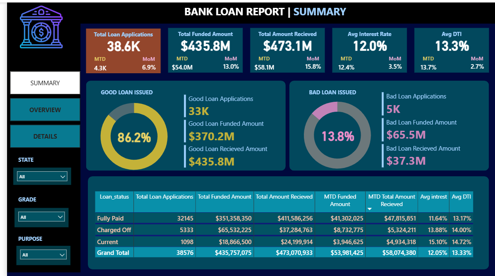

# 🏦 BANK LOAN REPORT | SUMMARY DASHBOARD

This repository contains a comprehensive **Bank Loan Management Dashboard** built in Power BI to analyze and monitor loan portfolio performance. The dashboard provides critical insights into loan applications, funded amounts, repayments, and risk metrics to support data-driven lending decisions.

## 📊 KEY PERFORMANCE INDICATORS (KPIs)

### Portfolio Summary

| Metric | Total | MTD | MoM Change |
|--------|-------|-----|------------|
| **Total Loan Applications** | 38.6K | 4.3K | ▲ 6.9% |
| **Total Funded Amount** | $435.8M | $54.0M | ▲ 13.0% |
| **Total Amount Received** | $473.1M | $58.1M | ▲ 15.8% |
| **Avg Interest Rate** | 12.0% | 3.5% | ▲ 13.7% |
| **Avg DTI** | 13.3% | - | - |

### Loan Quality Overview

| Category | Applications | Funded Amount | Received Amount |
|----------|--------------|---------------|-----------------|
| **GOOD LOAN ISSUED** | 33K (86.2%) | $370.2M | $435.8M |
| **BAD LOAN ISSUED** | 5K (13.8%) | $65.5M | $37.3M |

## 📈 LOAN STATUS BREAKDOWN

| Loan Status | Total Loan Applications | Total Funded Amount | Total Amount Received | MTD Funded Amount | MTD Amount Received | Avg Interest | Avg DTI |
|-------------|------------------------|---------------------|----------------------|-------------------|---------------------|--------------|---------|
| **Fully Paid** | 32,145 | $351,358,350 | $411,586,256 | $41,302,025 | $47,815,851 | 11.64% | 13.17% |
| **Charged Off** | 5,333 | $65,532,225 | $37,284,763 | $8,732,775 | $5,324,211 | 13.88% | 14.00% |
| **Current** | 1,098 | $18,866,500 | $24,199,914 | $3,946,625 | $4,934,318 | 15.10% | 14.72% |
| **GRAND TOTAL** | **38,576** | **$435,757,075** | **$473,070,933** | **$53,981,425** | **$58,074,380** | **12.05%** | **13.33%** |

## 🔍 KEY INSIGHTS

- **Strong Repayment Performance:** $473.1M received against $435.8M funded (108.5% recovery rate)
- **Good Loan Ratio:** 86.2% of applications are performing well (Fully Paid + Current)
- **Charge-Off Rate:** 13.8% of applications charged off, representing $65.5M in risky lending
- **Higher Risk Loans:** Charged-off loans have higher avg interest (13.88%) and DTI (14.00%)
- **Current Loans:** Highest interest rates (15.10%) indicating recent higher-risk lending
- **Monthly Growth:** MTD applications (+6.9%), funding (+13.0%), and receipts (+15.8%)

## ⚡ Advanced Power BI Features Implemented

### 🔐 Row-Level Security (RLS)
- **Dynamic Data Access:** Restrict loan data based on user roles (Loan Officers, Managers, Executives)
- **Role-Based Views:** Different levels of access for different user types
- *Benefit: Ensures sensitive loan data is only visible to authorized personnel*

### 📑 Page Navigation & Bookmarks
- **Multi-Page Dashboard:** Summary, Overview, and Details pages with smooth navigation
- **Bookmarked Views:** Saved views for different analysis scenarios
- *Benefit: Enhanced user experience with guided analytics*

### 🔍 Drill-Through Functionality
- **Contextual Deep-Dive:** Right-click any loan status to drill through to detailed loan-level data
- **Cross-Filtering:** Maintains context when navigating from summary to detail
- *Benefit: Enables root-cause analysis without cluttering the main dashboard*

## 📊 Advanced DAX Measures
// Time Intelligence Measures
MTD Applications = TOTALMTD(COUNT(Loans[LoanID]), 'Date'[Date])

MoM Change % =
VAR CurrentMonth = [MTD Applications]
VAR PreviousMonth = CALCULATE([MTD Applications], DATEADD('Date'[Date], -1, MONTH))
RETURN
DIVIDE(CurrentMonth - PreviousMonth, PreviousMonth, 0)

// Loan Quality Measures
Good Loan % =
DIVIDE(
CALCULATE(COUNT(Loans[LoanID]), Loans[Status] IN {"Fully Paid", "Current"}),
COUNT(Loans[LoanID]),
0
)

// Recovery Rate
Recovery Rate = DIVIDE([Total Amount Received], [Total Funded Amount], 0)

text

## 🛠️ Technical Implementation

### Power BI Features Used:

| Feature | Description |
|---------|-------------|
| ✅ **Row-Level Security (RLS)** | Role-based data access for loan data |
| ✅ **Page Navigation** | Multi-page dashboard with buttons |
| ✅ **Bookmarks** | Saved views for different analysis scenarios |
| ✅ **Drill-Through** | Detailed loan-level transaction analysis |
| ✅ **DAX Measures** | Time intelligence (MTD, MoM), KPI calculations |
| ✅ **Conditional Formatting** | Color-coded loan status and trends |
| ✅ **Tooltips** | Hover-based detailed metrics |

## 📁 Data Model
┌─────────────────┐ ┌─────────────────┐
│ Loans │─────│ Date │
│ (Fact Table) │ │ (Dimension) │
│ - Loan ID │ │ - Date │
│ - Amount │ │ - Month │
│ - Status │ │ - Year │
│ - Interest Rate │ └─────────────────┘
│ - DTI │ │
│ - Grade │ │
└─────────────────┘ │
│ │
│ ┌─────▼─────┐
│ │ Filters │
│ └───────────┘
┌────▼────┐
│ Borrower │
│(Dim) │
└─────────┘

text

## 📁 Dataset Information

The dashboard uses bank loan data containing:

- **Loan Applications:** 38.6K total applications with MTD tracking
- **Loan Performance:** Status tracking (Fully Paid, Charged Off, Current)
- **Financial Metrics:** Funded amounts, received amounts, interest payments
- **Risk Indicators:** Interest rates, DTI ratios, loan grades
- **Temporal Data:** Monthly and MTD performance metrics

## 🎯 Project Objectives

| Objective | Description |
|-----------|-------------|
| 📊 **Portfolio Monitoring** | Track loan applications, funding, and repayments |
| ⚖️ **Risk Assessment** | Monitor charge-off rates and risky segments |
| 📈 **Trend Analysis** | Identify monthly and month-over-month patterns |
| 💰 **Profitability Analysis** | Track interest income and recovery rates |
| 🔍 **Segmentation** | Analyze by loan grade, status, and borrower profile |
| 🔒 **Security Implementation** | Implement role-based access for loan data |

## 📑 Dashboard Pages

| Page | Description |
|------|-------------|
| **Summary** | High-level KPIs and portfolio health metrics |
| **Overview** | Detailed loan status breakdown with visualizations |
| **Details** | Granular loan-level data with drill-through capabilities |

## 🔧 Setup Instructions
Clone this repository
git clone https://github.com/yourusername/bank-loan-dashboard.git

Navigate to project folder
cd bank-loan-dashboard

text

### File Structure:
bank-loan-dashboard/
├── Bank_Loan_Dashboard.pbix # Main Power BI file
├── README.md # Documentation
├── bank.png # Dashboard screenshot
└── data/ # Source data files (if included)

text

### RLS Configuration:
1. Open Power BI Desktop
2. Go to Modeling → Manage Roles
3. Create roles (LoanOfficer, Manager, Executive)
4. Apply DAX filters as needed
5. Test with "View As" feature

## 📬 Connect With Me

- **LinkedIn:** [Your LinkedIn Profile](https://linkedin.com/in/yourprofile)
- **GitHub:** [@yourusername](https://github.com/yourusername)

## 📄 License

This project is open source and available under the [MIT License](LICENSE).

---

## 🔄 Future Enhancements

- [ ] Add predictive modeling for loan default risk
- [ ] Implement customer segmentation analysis
- [ ] Create cohort analysis for loan performance
- [ ] Add geographical distribution maps
- [ ] Include macroeconomic indicators correlation

---

## ⭐ Key Achievements

✅ Built comprehensive loan portfolio monitoring system  
✅ Implemented MTD and MoM trend analysis  
✅ Created risk segmentation framework  
✅ Developed interactive drill-through capabilities  
✅ Designed executive-level KPI dashboard  
✅ Implemented Row-Level Security for data governance  

---

**⭐ If you find this project useful for understanding loan portfolio management, please consider giving it a star!**
